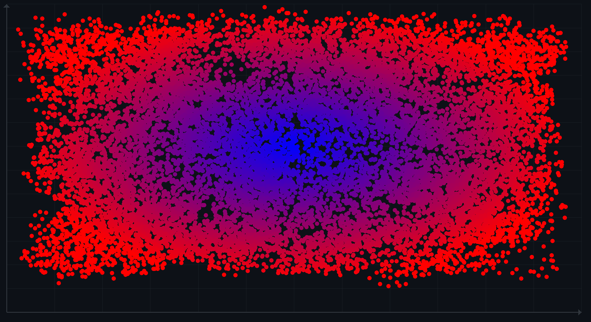
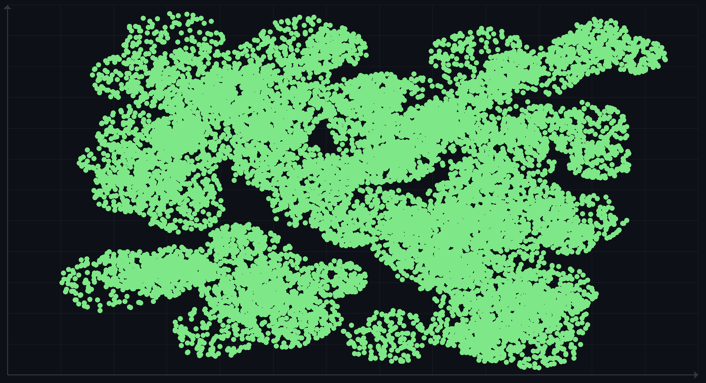
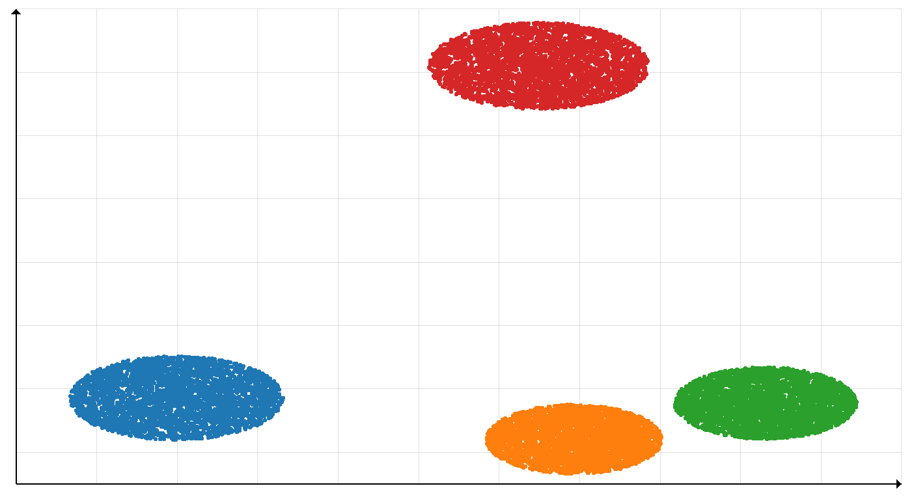

# Locus

Locus is a graphing and plotting library written in Rust, leveraging Raylib for rendering. It provides a structured way to visualize data through a composable architecture.



## Architecture

The library is built around a strong separation of concerns between data representation ("Chart Elements") and the final rendering on screen ("Plot Elements"). This distinction allows for flexible coordinate systems and view transformations.

### Core Traits

* **ChartElement**: This trait is implemented by components that exist in their own data coordinate space. Use this for data that needs to be scaled and translated to fit the screen. Examples include datasets, mathematical functions, or geometric shapes defined by their actual values.
    * Requires `data_bounds()` to define the extent of the data.
    * Requires `draw_in_view()` to render using a `ViewTransformer`.

* **PlotElement**: This trait is for components that are drawn directly or have already been transformed. `Graph<T>` itself implements this trait, allowing the entire graph to be placed on the screen.

### The Graph Orchestrator

The `Graph<T>` struct serves as the main container for visualization. It wraps a subject (which implements `ChartElement`) and manages the surrounding context:
* **Axis**: Automatically calculated or manually specified axes.
* **GridLines**: Visual guides corresponding to the unit separation of the data.
* **Colorscheme**: Thematic consistency across the visualization.

The `Graph` takes the subject's data bounds and the configured screen bounding box to create a `ViewTransformer`.

```text
+-----------------------------------------------------------------------+
|                      Graph<T> (impl PlotElement)                      |
|                                                                       |
|   +---------------------+            +----------------------------+   |
|   |   GraphConfig       |            |      Subject (T)           |   |
|   |  - BoundingBox      |            |   (impl ChartElement)      |   |
|   |  - Colorscheme      |            |                            |   |
|   |  - Offsets          |            |  - Defines Data Bounds     |   |
|   +----------+----------+            |  - Draws specific data     |   |
|              |                       +-------------+--------------+   |
|              |                                     |                  |
|              v                                     v                  |
|   +---------------------+            +----------------------------+   |
|   |   ViewTransformer   | <--------> | draw_in_view(rl, ..., view)|   |
|   |                     |    uses    |                            |   |
|   | Maps:               |            | Transforms Data Coords ->  |   |
|   | Data <--> Screen    |            | Screen Coords for drawing  |   |
|   +---------------------+            +----------------------------+   |
|              |                                                        |
|              v                                                        |
+-----------------------------------------------------------------------+
               | .plot()
               v
      [ Raylib Render Context ]
```

### View Transformation

The `ViewTransformer` is responsible for the mathematical mapping between:
1.  **Data Space**: The arbitrary coordinates of your dataset (e.g., -50.0 to 50.0).
2.  **Screen Space**: The actual pixels on the window (e.g., 0 to 1920).

It handles scaling (zooming) and translation (panning/offsets) to ensure the data fits correctly within the designated `bounding_box` on the screen.

## Configuration

Locus uses the Builder pattern extensively for configuration, ensuring that setting up a complex graph remains readable. The `GraphBuilder` allows you to customize:
* `bounding_box`: The area on the screen where the graph is drawn.
* `offset`: Manual adjustments to the view.
* `axis` and `grid`: Toggling and configuring guides.
* `colorscheme`: Defining the visual palette.

Example configuration flow:

```rust
// Pseudocode example
let graph = Graph::new(subject);
graph.plot(&mut rl_handle, GraphBuilder::default()
    .bounding_box(screen_rect)
    .colorscheme(Colorscheme::dark())
    .build()
    .unwrap()
);
```

## Todo List
- [ ] Dynamic Plots
- [ ] Labeling for axis and plot title
- [ ] Someway to increase the resolution
- [ ] Some way to save the graph
- [ ] Find a better way to include colorscheme as a way to color points
- [ ] Make a better way to have primitives, that aren't just a point and lines
- [ ] General quality of improvements

## Gallery


_Scatter plot visualization_


_K-Means clustering visualization_
